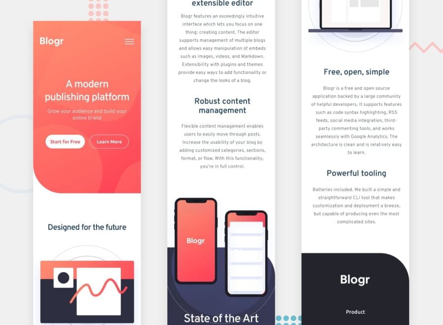

<h1 text-align="center">Blogr landing page</h1>

---

Este projeto foi parte do desafio <a href="https://www.frontendmentor.io/challenges/blogr-landing-page-EX2RLAApP">Blogr landing page</a> da plataforma FrontEnd Mentor

 <a href="#desafio">O desafio</a> | 
 <a href="#tecnologias">Tecnologias</a> | 
 <a href="#identidade">Identidade</a> | 
 <a href="#links">Links</a> |
 <a href="#redes">Redes</a>

---

### Visão Geral

#### O desafio

O usuário pode:

- Usufruir do layout do aplicativo independente do tamanho da tela (Design Responsivo);
- Ver os estados ativos e com foco dos elementos;
- Ver cada página e poder navegar pelos menus internos.

---

#### Tecnologias

- HTML5 semântico
- CSS 
- Flexbox
- Mobile-first
- JavaScript

---

#### Identidade

<h4>Para desktop</h4>

---

<h4>Para mobile e tablet</h4>

---
#### Links

<a href="https://kevinfigueira.github.io/Blogr-Landing-Page-Main/" target="_blank">Link do site</a>

#### Redes

Perfil do FrontEnd Mentor - <a href="https://www.frontendmentor.io/profile/kevinfigueira">@kevinfigueira</a>

